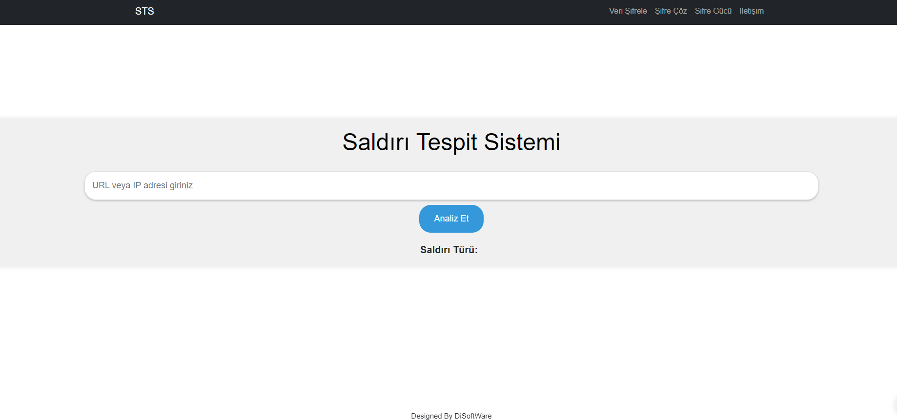

# Saldırı Tespit Sistemi , Özel Kriptoji algoritması ile veri şifreleme , Şifre Çözme Ve Şifre Gücü Belileme

- Bu proje, kullanıcıdan alınan URL adresine yönelik saldırı olup olmadığını tespit eden bir  sayfa içerir. Uygulama, girilen adresi analiz eder ve olası saldırı türünü belirler.
- Aynı zaman Özel Kriptoji algoritması ile metin şifreleme sayfası ve şifrelenmiş metini çözme sayfası bulunur
- Ve Şifre Gücü belireme Aracına Sahip
## Özellikler

- Kullanıcı dostu arayüz
- Analiz sonuçlarını görüntüleme
- Yükleniyor animasyonu
- Ve birçok estetik özellikler

## Kurulum

Bu projeyi yerel ortamınızda çalıştırmak için aşağıdaki adımları izleyin.

### Gerekli Yazılımlar

- Node.js (>= 14.x)
- npm veya yarn paket yöneticisi

### Adımlar

1. Bu projeyi klonlayın veya indirin:
   ```bash
   git clone https://github.com/osmantemel/hack.git
   cd SafeSurf-Çevrimiçi-Güvenlik-ve-Veri-Koruma-Sistemi
   cd frontend
   ```

2. Gerekli bağımlılıkları yükleyin:
   ```bash
   npm install
   # veya
   yarn install
   ```

3. Uygulamayı çalıştırın:
   ```bash
   npm start
   # veya
   yarn start
   ```
4. Tarayıcınızda `http://localhost:3000` adresine giderek uygulamayı görüntüleyin.

5. API dosyasına yerleşin
   ```bash
   cd ..
   cd api
   ```

6. API çalıştırın
   ```bash
    python app.py
   ```


## Saldırı Tespit Sistemi Kullanımı

1. Uygulamayı başlattıktan sonra, URL adresini giriş alanına yazın.
2. `Analiz Et` butonuna tıklayın.
3. Analiz sonuçlarını ve saldırı türünü ekranın altında görüntüleyin.

## API

Bu uygulama, arka planda çalışan bir API'yi kullanır. API, girilen URL veya IP adresine yönelik saldırı olup olmadığını tespit eder ve sonuçları JSON formatında döner.

### API İstekleri

- **POST** `/api/sts`
  - **Girdi:** `{ "url_or_ip": "girilmis_url_veya_ip" }`
  - **Çıktı:** `{ "attack_type": "saldiri_turu" }`

### Örnek İstek

```bash
curl -X POST http://127.0.0.1:5000/api/sts -H "Content-Type: application/json" -d '{"url_or_ip": "example.com"}'
```

## Proje Yapısı

```plaintext
saldiri-tespit-sistemi/
├── public/
│   ├── index.html
│   └── ...
├── src/
│   ├── App.js
│   ├── index.js
│   └── Sts.js
├── package.json
├── README.md
└── ...
```

- `public/`: Statik dosyalar ve ana HTML dosyası.
- `src/`: React bileşenleri ve ana uygulama dosyaları.
- `App.js`: Ana uygulama bileşeni.
- `index.js`: Uygulamanın giriş noktası.
- `Sts.js`: Saldırı Tespit Sistemi bileşeni.

## Katkıda Bulunma

Katkılarınızı memnuniyetle kabul ediyoruz! Lütfen önce bir konu açarak değişikliklerinizi tartışın.

1. Fork yapın (https://github.com/osmantemel/hack/fork)
2. Bir dal oluşturun (`git checkout -b feature/AmazingFeature`)
3. Değişikliklerinizi yapın (`git commit -m 'Add some AmazingFeature'`)
4. Dalınıza ittirin (`git push origin feature/AmazingFeature`)
5. Bir Pull Request açın


## Kullanılan Teknolojiler

- React
- Node.js
- npm 
- Flask (API için)
- Python

## Ekran Görüntüleri

Ana ekran:



## Yazarlar

- **Osman Temel** - - [osmantemel](https://github.com/kullaniciadi)
- **Hünkar Acar** - - [hunkaracar](https://github.com/kullaniciadi)

## Teşekkür

Bu projede katkısı olan herkese teşekkürler!
